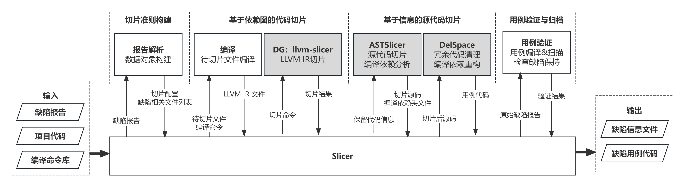
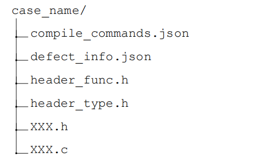
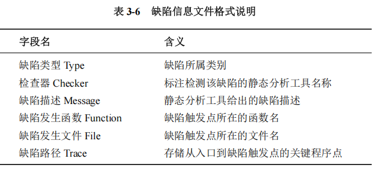

# Slicer
----
Slicer是基于两阶段切片技术实现的缺陷用例提取工具。由 Python 语言开发，图中灰色方框表示的外部可执行程序由 C++ 语言开发。其中，基于依赖图的代码切片基于开源库DG提供的 llvm-slicer 工具修改，增加了结果映射过程，使其输出保留代码位置信息文件。


## 快速开始
[scripts](./astslicer/scripts)中提供了自动化运行的脚本，参考流程如下：

1. 对缺陷来源项目执行以下命令，获取缺陷路径和编译命令库
	```shell
	scan-build -plist-html -disable-checker deadcode.DeadStores  make -j "$(nproc)" all
	make clean
	bear -- make CC=clang-18 CXX=clang++-18 -j "$(nproc)" all
	```
2. 编译dg-master、astslicer、delspace三个工具，详见各自的readme。
3. 修改[start.py](./astslicer/scripts/start.py)中的参数，运行
	- base_dir：项目目录
	- cc_dir：编译命令库（compile_commands.json路径）
	- directory_path：缺陷路径（CSA扫描得到的，plist格式）
4. 可在指定的输出目录（默认为`Slicer/output`）/logs 下查看运行日志。

## 工具介绍
### 工具基础信息
**输入**：Slicer 目前仅支持 Clang Static Analyzer 扫描产生的.plist 格式缺陷报告作为输入
**输出**：默认输出在`Slicer/output` 目录下，每个项目目录对应一个输出目录，包含多个用例和一个公共头文件。
	
公共头文件包含常见的include，复制源于[common.h](./astslicer/scripts/common.h)，不保证符合所有项目的需求，需要人工调试。

### 用例格式、内容说明
- 用例的名字是缺陷报告名+缺陷id
- 缺陷用例 = 缺陷用例代码（头文件+C文件） + 缺陷信息文件defect_info.json + 编译命令

<!--  -->

### 文件介绍
1. 主函数
	- [start.py](./astslicer/scripts/start.py) 接收输入，启动工具
2. 处理类
	- [Plist.py](./astslicer/scripts/Plist.py) 表示一个缺陷报告，`process_single_plist`函数表示了处理一个报告的流程
	- [Diagnostic.py](./astslicer/scripts/Diagnostic.py) 表示报告中的一个警报（缺陷）
	- [DefectInfoCreator.py](./astslicer/scripts/DefectInfoCreator.py) 缺陷用例的信息生成器，依赖DC工具的DefectCase类（[DefectCaseInfo.py](../defect_classfier/scripts/DefectCaseInfo.py)），生成defect_info.json
3. 工具类 
	- [Tool.py](./astslicer/scripts/Tool.py) 提供一些工具函数
	- [parse_ast.py](./astslicer/scripts/parse_ast.py) 生成AST并进行简单的分析
	- [handle_plist.py](./astslicer/scripts/handle_plist.py) 处理缺陷报告文件
	- [process_compile_commands.py](./astslicer/scripts/process_compile_commands.py) 处理编译命令库，编译并链接待切片文件
4. 其他文件
	- [constants.py](./astslicer/scripts/constants.py) 存放常量，可配置脚本中使用的各类路径

### tips
参考的项目编译命令
```shell
cmake  -D CMAKE_C_COMPILER=clang -D CMAKE_CXX_COMPILER=clang++ ..
make -j4

./configure CC=clang-18 CXX=clang++-18
```