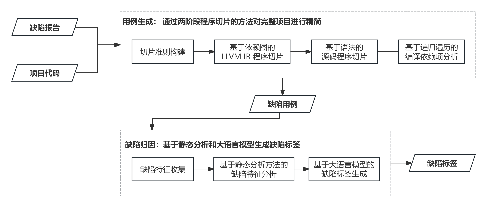

# Slicing-based Test case Generator（STG）

STG 是一个基于程序切片技术的缺陷用例生成工具。系统整体架构如图，分为缺陷用例生成 [Slicer](./Slicer/README.md) 与缺陷标签生成 [DT](./defect_classfier/README.md) 两个核心子系统。系统输入为缺陷报告和项目源代码，内部先经过 Slicer 对项目代码进行精简，形成可独立编译的缺陷用例代码；再通过 DT 为用例进行标注，完善缺陷用例信息；最终输出缺陷信息文件和缺陷用例代码。

