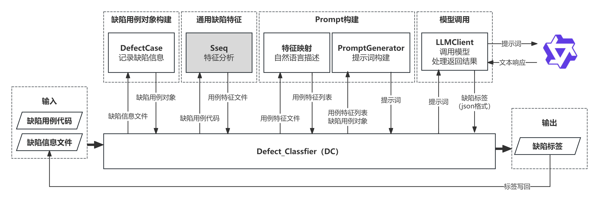

# DefectClassfier

实现缺陷分类的工具，由通用特征分析工具Sseq和运行脚本scripts两部分组成。


## Sseq 
通过AST分析缺陷的场景特征，详见`./Sseq/README.md`。在执行下述脚本前需要编译Sseq。

## scripts
运行脚本
### 文件介绍
1. 主函数
    - [start.py](./scripts/start.py)
2. 处理类
    - [DefectCaseInfo.py](./scripts/DefectCaseInfo.py) 表示一个缺陷用例的信息，与Slicer生成的defect_info.json中字段对应
    - [PromptGenerator.py](./scripts/PromptGenerator.py) 提示词生成器
    - [LLMClient.py](./scripts/LLMClient.py) 配置模型调用参数，并调用模型，处理返回结果（json）
3. 工具类 
    - [Tool.py](./scripts/Tool.py) 调用外部程序（Sseq）
    - [feature_mapping.py](./scripts/feature_mapping.py) 实现特征id到自然语言描述的转换，依赖`特征说明_local.xlsx`
    - [calculate.py](./scripts/calculate.py) 计算实验指标：Jaccard相似度、宏平均F1、微平均F1
4. 配置文件
    - [特征说明_local.xlsx](./scripts/特征说明_local.xlsx) 说明了特征的含义
    - [filter.json](./scripts/filter.json) 控制会被输入给模型的特征列表

### 使用方法
1. 环境配置
    python 3.8+, 并安装libclang和clang库  
	```shell
    pip3 install libclang==12.0.0
    pip3 install clang==12.0.1
	```
    大模型调用使用百炼平台，需要提前进行配置API-KEY。可参考 [百炼平台API应用调用](https://bailian.console.aliyun.com/?tab=api#/api/?type=app&url=https%3A%2F%2Fhelp.aliyun.com%2Fdocument_detail%2F2846133.html)设置环境变量`DASHSCOPE_API_KEY`
2. 运行参数
    /bin/python3 - [start.py](./scripts/start.py) -d DIRECTORY -o OUTPUT
    - DIRECTORY  # 存储缺陷用例的路径
    - OUTPUT  # 程序特征信息和本次运行日志输出路径
3. 输出目录结构
   - /features  # Sseq生成的特征文件 和 Sseq的日志
   - /LLM_output/模型名/日期 # 大模型输出结果
   - /logs # 日志
4. 示例
    ```shell
    python3 /home/nishikino/new_version_benchmarks/defect_classfier/scripts/start.py  -d /home/nishikino/new_version_benchmarks/output/bzip3-1.4.0/
    ```


